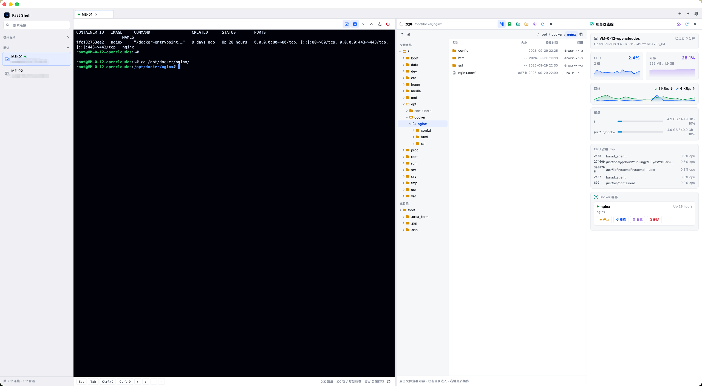
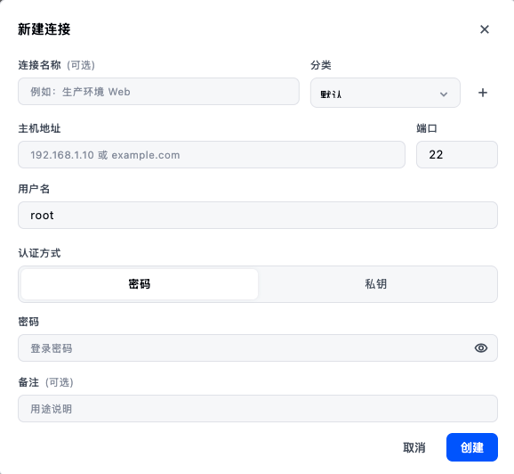

# Fast Shell

> 面向 macOS 的轻量远程运维工作台 —— 一个窗口里完成 **SSH 终端 + SFTP 文件管理 + 服务器监控**。

[](LICENSE)
[]()
[](https://flutter.dev)

技术栈：Flutter 3.47（macOS Desktop）· dartssh2（SSH / SFTP）· xterm.dart（终端渲染）· cryptography（AES-256-GCM 本地加密）

---

## 下载安装

到 [版本发布页](https://cnb.cool/hhaip.com/opensource/fast-shell/-/releases) 下载最新版的
`Fast-Shell-<版本>-macos.zip`，解压后把 `Fast Shell.app` 拖进「应用程序」。

首次打开若被 Gatekeeper 拦下（本地自签名、未经过 Apple 公证）：

```bash
xattr -dr com.apple.quarantine "/Applications/Fast Shell.app"
```

> 系统要求 macOS 12+，Apple Silicon / Intel 均可。

---

## 截图

**主界面** —— 终端、SFTP 文件、服务器监控三栏并排，一个窗口完成日常运维：



**新建连接**：



---

## 为什么做这个

日常运维往往要在「终端工具 + 文件传输工具 + 一个 ssh 进去敲 `top` 的窗口」之间来回切。
Fast Shell 把这些合到一个原生 macOS 窗口里：连上主机，终端在左、文件在右、监控一键展开，
连接信息全部本地加密保存，不经过任何服务器。

---

## 功能

### 1. 连接管理
- 连接增删改：名称、分类、主机、端口、用户名、备注
- 认证方式：密码 / 私钥（可选私钥文件，或直接粘贴私钥内容，支持私钥密码短语）
- **主机指纹校验**：首次连接弹窗核对 SHA256 指纹，信任后写入本地；指纹变化时红色告警，防中间人攻击
- 分类管理：内置「默认」不可删，其余分类可新增 / 删除，删除后其下连接自动归入「默认」
- 分类折叠、关键字搜索、右键菜单（打开 / 编辑 / 创建副本 / 复制 `ssh` 命令 / 清除主机指纹 / 删除）
- 快速连接：搜索框或 `⌘T` 输入 `user@host:port` 直接开临时会话
- 最近连接：欢迎页一键回到常用主机

### 2. 终端
- 多标签并行会话，标签显示连接名与实时连接状态
- 256 色 / 真彩色渲染，回滚缓冲 10000 行，窗口尺寸变化自动下发 `pty-req`
- 功能键条：`Esc` / `Tab` / `Ctrl+C` / `Ctrl+D` / 方向键
- 断线提示与一键重连，字号实时调整
- **日志不截断**：终端采用字符网格渲染（xterm），只绘制可见区域，任意长度的滚动输出都不会拖垮界面

### 3. 服务器监控（`⌘⇧M`）
- 主机概览：主机名 / 内核 / 发行版 / 运行时长 / 负载
- CPU 总占用与单核曲线、内存与 Swap、磁盘挂载点用量条、网络上下行实时速率
- CPU 占用 Top 进程列表（PID / 用户 / 命令 / 占用）
- **Docker 容器管理**：列表（名称 / 镜像 / 状态 / 内存 / 网络 IO），支持启动 / 停止 / 重启 / 删除 / 查看日志
- 容器日志全屏查看，可跟随滚动，同样不做截断
- 连接建立后**后台预取首份数据**，点开面板即刻出数，不用再等冷启动那十几秒
- 应用切到后台自动暂停轮询，回到前台恢复，不空耗 CPU

### 4. SFTP 文件传输（`⌘⇧F`）
- **目录树**：左侧可视化整棵系统目录（懒加载展开、点击跳转、当前目录高亮，可折叠）
- **文件内容查看 / 编辑**：点击文件直接显示内容（UTF-8，上限 1MB 给出截断提示、二进制识别告警），
  可在线编辑并保存回远端，未保存离开有二次确认
- 目录浏览：面包屑路径、上一级、主目录、点文件显示开关
- 上传：多选文件 / 整个文件夹 / **直接拖拽到面板**，也可在目录右键「上传文件到此处」
- 下载：默认直接存到 `~/Downloads`（沙盒下唯一有明确写权限的位置，少一次面板交互）；
  右键也可选「下载到…（选择位置）」，该位置会先做一次真实写入探测，不可写则自动回退到 `~/Downloads` 并提示
- 下载采用「临时文件 + 原子改名」：中途失败或取消不会留下半截文件，也不会破坏本地同名文件
- 右键菜单：查看内容 / 编辑文件 / 下载到 `~/Downloads` / 下载到… / 重命名 / 新建文件夹 / 复制路径 / 删除（目录递归删除）
- 传输队列：进度条、实时速度、并行 2 个任务、可取消（取消后自动清理半截文件）、失败原因展示
- 传输记录**不会自动消失**：每行可手动清除记录；失败行保留并显示红色错误原因，成功行可一键「在访达中显示」
- 终端流式 UTF-8 解码：汉字 / 符号不会因 TCP 分块被切断而乱码

### 5. 安全与隐私
- 连接信息（含密码、私钥）整体 **AES-256-GCM** 加密落盘
- 加密密钥由「随机主密钥文件（权限 600）+ 本机硬件 UUID」经 HKDF 派生 → 配置文件拷到别的电脑无法解密
- 所有数据纯本地，不经任何网络上传，无遥测、无账号体系

---

## 快捷键

| 快捷键 | 作用 |
| --- | --- |
| `⌘ N` | 新建连接 |
| `⌘ T` | 快速连接 |
| `⌘ R` | 重新连接当前会话 |
| `⌘ ⇧ M` | 打开 / 收起服务器监控 |
| `⌘ ⇧ F` | 打开 / 收起文件面板 |
| `⌘ K` | 清空终端显示与回滚缓冲 |
| `⌘ C` / `⌘ V` | 复制选中文本 / 粘贴到终端 |
| `⌘ +` / `⌘ -` | 调整终端字号 |
| `⌘ W` | 关闭当前标签 |
| `⌘ ,` | 设置 |

---

## 构建与运行

### 环境要求
- macOS 12+（Apple Silicon 或 Intel）
- Flutter 3.47+（Dart SDK `^3.13.5`）
- Xcode Command Line Tools

### 步骤

```bash
git clone https://cnb.cool/hhaip.com/opensource/fast-shell.git
cd fast-shell

flutter pub get

# 开发运行（热重载）
flutter run -d macos

# 纯 Dart 逻辑自检（59 项，无需 GUI 环境）
dart run tool/verify.dart

# 静态检查
flutter analyze

# 打包 Release（推荐的发布路径：剥符号 + 产物体检）
tool/build_release.sh
# 等价于：
# flutter build macos --release --split-debug-info=build/symbols
# 产物：build/macos/Build/Products/Release/Fast Shell.app
```

### 首次打开被 Gatekeeper 拦下

本地自签名构建的 `.app` 未经过 Apple 公证：

```bash
xattr -dr com.apple.quarantine "build/macos/Build/Products/Release/Fast Shell.app"
```

### 渲染后端说明

Flutter 3.47 起 macOS 默认使用 **Impeller** 渲染后端，本项目在其上出现过斜向拉丝花屏，
因此 `macos/Runner/Info.plist` 中显式关闭，回退到 Skia：

```xml
<key>FLTEnableImpeller</key>
<false/>
```

若你的机器在 Impeller 下无异常，可移除该键以启用 Impeller 获得更好的合成性能。

### 沙盒配置

`macos/Runner/*.entitlements` 中已声明必要能力，改动前请留意：

| 权限 | 用途 |
| --- | --- |
| `com.apple.security.network.client` | SSH 出站连接（必需） |
| `com.apple.security.files.user-selected.read-write` | 上传 / 下载用户通过面板选择的文件 |
| `com.apple.security.files.downloads.read-write` | 默认下载目录（**下载功能的兜底保障，不要删**） |
| `com.apple.security.files.home-relative-path.read-only: ~/.ssh/` | 免手动选文件的私钥读取 |

> **注意**：`file_picker` 在 macOS 上只返回路径字符串，**不会**为返回的目录保留安全作用域书签。
> 因此在沙盒里，把文件写进用户通过面板选择的目录有时会被系统拒绝。
> 这就是下载默认落地 `~/Downloads`、自选位置前先做一次写入探测的原因。

### 发布新版本

安装包通过 **CNB Release** 分发（与 GitHub Releases 等价，支持指定版本号与附件下载）。
一条命令完成「打标签 → 构建 → 打包 → 建版本 → 传附件 → 确认」：

```bash
CNB_TOKEN=<访问令牌> tool/publish_release.sh 1.1.0
# 指定发布说明（放 docs/releases/ 下随代码一起版本管理）：
CNB_TOKEN=<访问令牌> tool/publish_release.sh 1.1.0 --notes docs/releases/v1.1.0.md
# 只重新上传、不重新构建：
CNB_TOKEN=<访问令牌> tool/publish_release.sh 1.1.0 --skip-build
# 只改版本说明，不碰构建与附件（附件几十 MB，没必要重传）：
CNB_TOKEN=<访问令牌> tool/publish_release.sh 1.1.0 --notes-only --notes docs/releases/v1.1.0.md
```

访问令牌在 <https://cnb.cool/profile/token/create> 创建，**授权范围必须包含 `repo-release:rw`**。
注意 `cnb login` 拿到的 OAuth 令牌不带这个权限，只能用访问令牌。

附件上传是标准三步（脚本已封装）：取 COS 预签名地址 → `PUT` 直传对象存储 → 回调 `verify_url` 确认。
少了最后一步，附件会停在「传上去了但看不到」的状态。

---

## 数据存放位置

| 内容 | 路径 |
| --- | --- |
| 加密配置（连接 + 设置） | `~/Library/Containers/com.hhaip.hhaipShell/Data/Library/Application Support/com.hhaip.hhaipShell/vault.enc` |
| 主密钥（权限 0600） | 同目录 `vault.key` |

> 删除 `vault.key` 会导致已有连接配置无法解密（应用会自动把损坏文件备份为 `vault.enc.corrupt-*` 并重置）。

---

## 代码结构

```
lib/
├── main.dart                    # 入口：先 runApp，再异步初始化加密仓库（缩短启动白屏）
├── models/
│   ├── app_settings.dart        # 应用设置（字号、分类列表等）
│   ├── connection.dart          # 连接模型 + 序列化
│   ├── remote_entry.dart        # 远端目录项
│   └── transfer_task.dart       # 传输任务（进度 / 速度 / 状态）
├── services/
│   ├── vault.dart               # AES-256-GCM 本地加密仓库（HKDF + 机器 UUID）
│   ├── ssh_session.dart         # SSH 会话 + SFTP 通道封装 + 流式 UTF-8 解码
│   ├── monitor_service.dart     # 远端指标采集（CPU/内存/磁盘/网络/进程/容器）
│   ├── local_io.dart            # 本地下载目录 / 写入探测 / 访达定位 / 错误翻译
│   ├── log_text.dart            # 日志文本纯函数（净化 / 行数统计），可独立自检
│   └── remote_path.dart         # 远端路径工具
├── state/
│   ├── app_store.dart           # 全局状态：连接 / 标签 / 传输 / SFTP / 设置
│   └── monitor_state.dart       # 每标签页的监控状态：轮询 / 曲线 / 容器 / 日志
└── ui/
    ├── home_page.dart           # 主框架：侧栏 + 标签栏 + 工作区 + 全局快捷键
    ├── sidebar.dart             # 连接列表（搜索 / 分类 / 右键菜单）
    ├── connection_editor.dart   # 连接编辑弹窗（含分类管理）
    ├── terminal_panel.dart      # 终端视图 + 工具栏 + 功能键条
    ├── monitor_panel.dart       # 服务器监控 + Docker 容器 + 日志全屏
    ├── sftp_panel.dart          # 文件面板（目录树 / 查看 / 编辑 / 上传下载）
    ├── transfer_bar.dart        # 传输队列
    ├── settings_dialog.dart     # 设置
    ├── quick_connect.dart       # 快速连接解析
    ├── theme.dart               # 配色 / 主题 / 终端配色
    └── widgets/common.dart      # 通用小组件与弹窗
tool/
├── verify.dart                  # 纯 Dart 自检（59 项），CI 可直接跑
├── build_release.sh             # 标准发布打包（剥符号 + 产物体检）
├── publish_release.sh           # 发布到 CNB Release（打包 + 建版本 + 传附件）
├── sftp_smoke.dart              # SFTP 冒烟脚本
└── gen_logo.py                  # 应用图标生成（纯 Python SDF 抗锯齿）
```

---

## 性能取舍

项目在「长时间挂着不卡」上做了若干针对性处理，供参考：

- **终端不用 `SelectableText` 逐行渲染**，改用 xterm 的字符网格 —— 只画可见区域，滚动缓冲再大也不影响帧率
- **监控曲线**用 `CustomPainter` 手绘并精确实现 `shouldRepaint`，避免每帧无谓重绘
- **日志刷新自驱动**：终端监听数据变化后 250ms 节流局部刷新，不触发整页 `setState`
- **重绘隔离**：终端、日志、曲线各自包在 `RepaintBoundary` 内
- **后台暂停轮询**：应用失焦 / 最小化时停掉所有远程采样
- **关闭标签延迟释放**：先通知 UI 移除，渲染帧结束后再 `dispose`，避免渲染树在帧中被拆导致的残留花屏
- **打包瘦身**：移除未使用字体依赖，`--split-debug-info` 剥离调试信息，发布脚本会列出包体构成并检查是否误打包了 `*.dart` / `*.dSYM` / `tool` / `test`

---

## 品牌

- 产品名：**Fast Shell**
- 图标：`tool/gen_logo.py` 生成（SDF 抗锯齿纯 Python 渲染），写入 `macos/Runner/Assets.xcassets/AppIcon.appiconset/`，界面内使用 `assets/logo.png`

---

## 已知边界

- 目前只提供 macOS 桌面版（Windows 版需补 `flutter create --platforms=windows` 与对应窗口配置）
- 未接入 SSH Agent（`SSH_AUTH_SOCK`）与跳板机 ProxyJump，也未提供端口转发面板
- 文件上传 / 下载按 256KB 分块流式传输，进度按字节统计，暂不支持断点续传
- 文件在线编辑上限 1MB（超出会提示，不做静默截断）
- 监控采集依赖远端常见命令（`/proc`、`df`、`ps`、`docker`），极小众发行版可能部分指标为空

---

## 贡献

欢迎提交 Issue 与 Pull Request，详见 [CONTRIBUTING.md](CONTRIBUTING.md)。

提交前请确保：

```bash
dart run tool/verify.dart   # 59 项自检全绿
flutter analyze             # 无 warning 及以上
```

## 更新记录

见 [CHANGELOG.md](CHANGELOG.md)。

## License

[MIT](LICENSE) © hhaip
